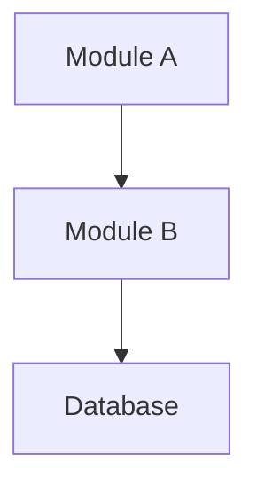

# [Feature Name] Design Brief

> **Aegis ID:** AEGIS-{project}-{seq}
> **Author:** {name}
> **Date:** {YYYY-MM-DD}
> **Status:** Draft | In Review | Approved
> **Mode:** Lite | Full

---

## Problem Statement

What problem does this solve? Why now? (1-3 sentences)

## Architecture Overview

<!-- Mermaid or ASCII diagram. Standard: an engineer unfamiliar with the project
     can sketch the system after reading this section. -->

## Key Design Decisions

| Decision | Choice | Rationale | Alternatives Considered |
|----------|--------|-----------|------------------------|
| Database | PostgreSQL | ACID compliance needed for billing | MongoDB (flexible but weak txn), DynamoDB (too opinionated) |

## Module Boundaries

### Module A
- **Responsibility:** ...
- **Exposes:** `POST /api/xxx`, `GET /api/yyy`
- **Depends on:** Module B (via REST), Database (direct)
- **Communication rule:** Only through defined interfaces

### Module B
- **Responsibility:** ...
- **Exposes:** Internal service methods
- **Depends on:** External API X

## API Surface (Summary)

Key interfaces (detailed definitions in `contracts/api-spec.yaml`):

- `POST /api/xxx` — Create resource. Input: `{...}`, Output: `{...}`
- `GET /api/yyy` — List resources. Paginated.
- WebSocket `event:zzz` — Triggered when ...

## Known Gaps & Open Questions

- [ ] **[blocking]** Gap 1: Description + impact scope + urgency
- [ ] **[non-blocking]** Gap 2: Description + impact scope + urgency

## Testing Strategy

| Layer | What | How |
|-------|------|-----|
| Unit | Business logic in Module A | Jest/Go test, mocking allowed |
| Contract | API responses match spec | OpenAPI validator against live responses |
| Integration | Module A ↔ Module B ↔ DB | docker-compose, real services |
| E2E | User flows | playwright-forge |

## Debugging Guide

- **Logs:** `{location}`, search for `requestId=xxx`
- **State query:** `GET /admin/debug/xxx`
- **Common failures:**
  - Symptom → Likely cause → Fix
  - Symptom → Likely cause → Fix
